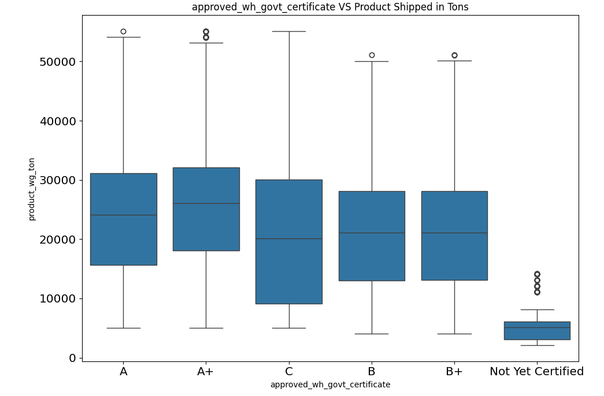
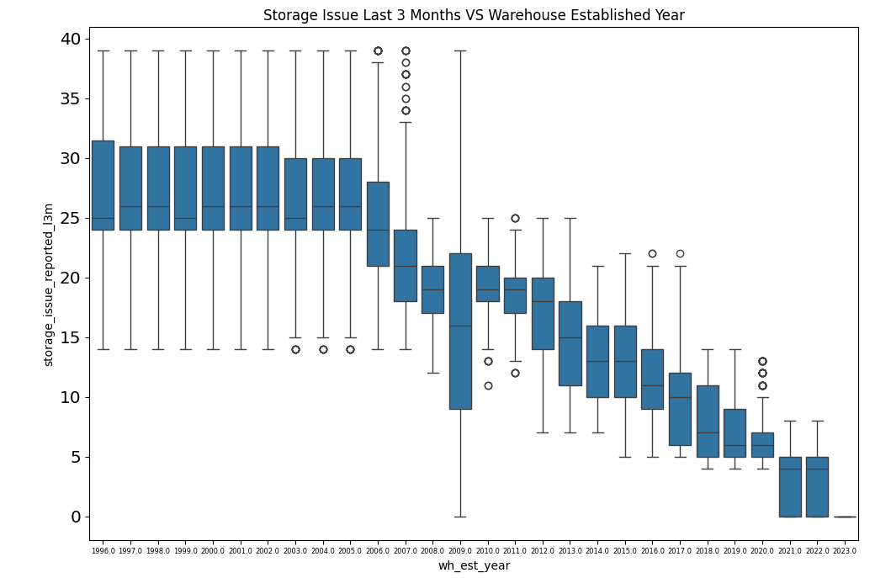

# Optimizing Warehouse Supply Allocation for FMCG Instant Noodles Company 🍜
This project analyzes the mismatch between demand and supply in FMCG warehouses using a combination of Python and Power BI. The analysis is done using descriptive, diagnostic, and prescriptive analytics approaches to optimize product distribution and warehouse efficiency. The results are visualized in an interactive dashboard as a management decision-making tool.
## 1. Background Information 📋
FMCG companies that have only been in the instant noodle business for two years are experiencing a mismatch between demand and supply of products in various warehouses. When demand is high, supply is low, and vice versa. This causes significant inventory cost losses. 
Therefore, management wants to understand more deeply the demand patterns and warehouse conditions in 
various regions in order to optimize product distribution.
## 2. Project Objective 🎯
Perform historical data analysis to:  
• Identify product demand patterns by region, location type, and 
warehouse characteristics.  
• Diagnose factors causing demand and supply mismatch.  
• Provide data-driven recommendations to optimize supply allocation and 
support managerial decision making through interactive dashboards.  
## 3. Business Questions & Analysis Method 🤔❓
### A. Zone and Location 🗺️  
• Q: Which zone or region most often experiences mismatch between warehouse capacity and product weight shipped?  
→ Descriptive + Diagnostic  
• Q: Does the location of the warehouse in a village or city affect the amount of product distribution?  
→ Descriptive + Diagnostic  
### B. Warehouse Capacity & Utilization 🏛️  
• Q: How optimally is the warehouse utilized (calculated from the ratio of product_wg_ton to 
WH_capacity_size)?  
→ Prescriptive  
• Q: Which warehouses are overused (exceeding ideal capacity) or underused?  
→ Diagnostic + Prescriptive  
### C. Logistics and Transportation 🚚  
• Q: Do warehouses with a history of transportation issues (transport_issue_l1y) have
lower shipments?  
→ Diagnostic  
• Q: How much does dist_from_hub affect the weight of products shipped?  
→ Diagnostic  
### D. Environment & Infrastructure  🏢
• Q: Do flood-impacted or non-flood-proof warehouses tend to have lower shipments?  
→ Diagnostic  
• Q: Is the presence of electric_supply or temp_reg_mach related to warehouse performance in product distribution?  
→ Diagnostic  
### E. Warehouse Activity 🏪 
• Q: Do warehouses that experience frequent refills (num_refill_req_l3m) also receive 
greater supplies?  
→ Descriptive + Diagnostic  
• Q: Does the number of distributors (distributor_num) have an impact on the total shipments 
of products to the area?  
→ Diagnostic  
• Q: How much influence does wh_breakdown_l3m have on the decline in supplies to the warehouse?  
→ Diagnostic  
### F. Market Competition 🛒  
• Q: Does the number of competitors (Competitor_in_mkt) affect the number of products shipped to an area?  
→ Diagnostic  
• Q: Which areas have market potential (few competitors, many retailers) but supply is still low?  
→ Prescriptive (opportunity mapping)  
### G. Certification and Compliance 📜  
• Q: Do warehouses with a certain approved_wh_govt_certificate have higher distribution performance?  
→ Descriptive  
• Q: Does the number of government inspection visits (govt_check_l3m) affect the supply to that warehouse?  
→ Diagnostic  
### H. Warehouse Eligibility & Age 📆  
• Q: Do warehouses built longer (wh_est_year) tend to have more problems and lower deliveries?  
→ Diagnostic  
### I. Combination of Factors 🕵  
• Q: What combination of factors (location, capacity, number of distributors, transportation) is most ideal
to support high shipments?  
→ Multivariate Diagnostic  
• Q: Zones with ideal conditions (safe from flooding, adequate electricity, smooth distribution) but
supply is still low – why?  
→ Prescriptive  
  
## 4. Data Understanding 📊  
This dataset consists of 25000 rows and 24 columns.  
  
**Information for each column**

- Ware_house_ID = Product warehouse ID  
- WH_Manager_ID = Employee ID of warehouse manager  
- Location_type = Location of warehouse like in city or village  
- WH_capacity_size = Storage capacity size of the warehouse  
- zone = Zone of the warehouse  
- WH_regional_zone = Regional zone of the warehouse under each zone  
- num_refill_req_l3m = Number of times refilling has been done in last 3 months  
- transport_issue_l1y = Any transport issue like accident or goods stolen reported in last one year  
- Competitor_in_mkt = Number of instant noodles competitor in the market  
- retail_shop_num = Number of retails shop who sell the product under the warehouse area  
- wh_owner_type = Company is owning the warehouse or they have get the warehouse on rent  
- distributor_num = Number of distributer works in between warehouse and retail shops  
- flood_impacted = Warehouse is in the Flood impacted area indicator  
- flood_proof = Warehouse is flood proof indicators. Like storage is at some height not directly on the ground  
- electric_supply = Warehouse have electric back up like generator, so they can run the warehouse in load shedding  
- dist_from_hub = Distance between warehouse to the production hub in Kms  
- workers_num = Number of workers working in the warehouse  
- wh_est_year = Warehouse established year  
- storage_issue_reported_l3m = Warehouse reported storage issue to corporate office in last 3 months. Like rat, fungus because of moisture etc.  
- temp_reg_mach = Warehouse have temperature regulating machine indicator  
- approved_wh_govt_certificate = What kind of standard certificate has been issued to the warehouse from government regulatory body  
- wh_breakdown_l3m = Number of time warehouse face a breakdown in last 3 months. Like strike from worker, flood, or electrical failure  
- govt_check_l3m = Number of time government Officers have been visited the warehouse to check the quality and expire of stored food in last 3 months  
- product_wg_ton = Product has been shipped in last 3 months. Weight is in tons
  
## 5. Exploratory Data Analysis 1 - Problem Discovery in Data Sets 📈  
### A. Descriptive Statistic  
- There is no issue with the data type in each column. However, there are several columns that have missing values, namely <mark>**workers_num**</mark>, <mark>**wh_est_year**</mark>, and <mark>**approved_wh_govt_certificate**</mark>. These columns need to be further analyzed for imputation purposes.
  
- All data from the numeric columns starting from the average, minimum value, median and maximum value have no anomalies or irregularities, everything looks normal. But there are some columns whose minimum and maximum values are always 0 and 1, namely <mark>flood_impacted</mark>, <mark>flood_proof</mark>, <mark>electric_supply</mark>, and <mark>temp_reg_mach</mark>. These columns contain nominal data, namely data that is only used to label or categorize without order. In the data transformation section, we will process and map it to the defined value. In the <mark>Competitor_in_mkt</mark> column, there are several values that have very little data and are not representative for visualization, we can create a segmentation for values that are more than or equal to 9.
- Put aside the Ware_House_ID and WH_Manager_ID columns because they are identifier or key data for each row. What is interesting is the Location_type column, where from the composition of the column values, the majority of warehouses are located in rural areas. The other columns still look normal.
### B. Univariate Analysis
- After seeing the results of the boxplot and distplot, there are several columns that have outliers, namely transport_issue_l1y, competitor_in_mkt, retail_shop_num and workers_num and the 4 columns have a positive or positively skew distribution. These columns are interesting for us to do a deeper analysis in the next section, namely Bivariate Analysis.
- As previously stated, the Location Type column is quite interesting because of the disparity in value between Rural and Urban. This column could be something interesting to do further analysis regarding the cause.

  
## 6. Data Cleaning & Transformation 🧹🧼✨  
### A. Imputation on Missing Values  
- Because the missing values ​​in the workers_num column were previously assumed to be because the warehouse was newly established or had not been recorded, but after checking with the warehouse establishment year column, it turned out that the distribution of the missing value data was random, so it will be imputed with the median of the WH_Capacity_Size group.
- For imputation on the wh_est_year column, it will be done by using the median value of all wh_est_year values ​​in the dataframe because it is normal in terms of distribution. But before that, flagging is done first to mark the rows whose wh_est_year is imputed, if later a more in-depth analysis is needed on warehouses whose year of establishment is empty.
- For the imputation of the approved_wh_govt_certificate column, an approach will be taken to create a new value, namely "Not Yet Certified" or "Unknown" so that it still appears in the visual.
### B. Mapping column values  
For the Competitor_in_mkt column, we create a new segmentation, namely ">= 9" for competitor values greater than or equal to 9 and the value 0 is combined with the value 1 and for value mapping in columns that contain nominal data but have not been defined, here is the mapping:  
  
flood_impacted:  
0: Not Impacted Area  
1: Impacted Area  
  
flood_proof:  
0: Not Flood Proof  
1: Flood Proof  
  
electric_supply:  
0: No Backup Power  
1: Has Backup Power  
  
temp_reg_mach:  
0: No Temperature Regulation  
1: Has Temperature Regulation  
  
## 7. Exploratory Data Analysis 2 - Insight Building 📈  
### A. Product Weight Shipped VS Storage Issue Reported Last 3 Months  
Warehouses with high shipping volumes tend to experience and report storage issues more frequently. This shows the importance of adaptive capacity management and storage infrastructure for high-performance warehouses.  
  
### B. Product Weight Shipped VS Warehouse Breakdown Last 3 Months  
  
### C. Do warehouses with a history of transportation issues (transport_issue_l1y) have lower shipments?  
  
### D. Do warehouses with a certain approved_wh_govt_certificate have higher distribution performance?  
  
### E. Do warehouses built longer ago (wh_est_year) tend to have more problems and lower deliveries?  
  
  
  
### F. Heatmap Correlation  
  
  
## 8. Visualization Strategy (Power BI Dashboard) 📊📈  
1. Header / Summary Cards (Top Section)  
Use: Card Visuals  
Metric Description  
  
- Total Product Distributed (ton) : Total sum of product_wg_ton || KPI >> (Percentage of Rural and Urban)  
- Avg Storage Issue (3 Mo) : Mean of storage_issue_l3m || KPI >> (Percentage of warehouses above average value)  
- Avg Warehouse Breakdown (3 Mo) : Mean of wh_breakdown_l3m || KPI >> (Avg. Warehouse Breakdown by Location Type)  
- % Certified Warehouses : Percentage of certified warehouses || KPI >> (Target Comparison (Target: 75%))  
- Avg Warehouse Age : 2025 - wh_est_year (mean) || KPI >> (Percentage of warehouses that are over 20 years old)  
- Total Transport Issue (1 Yr) : Sum of transport_issue_last_1year || KPI >> (Avg. Transport Issue / Warehouse)  
  
  
2. Operational Risk Section  
Title: "The Impact of Shipping Volume on Operational Problems"  
Visual 1: Scatter Plot  
  
X: product_wg_ton  
Y: storage_issue_l3m  
  
Visual 2: Scatter Plot / Bubble Chart  
  
X: product_wg_ton  
Y: wh_breakdown_l3m  
  
Size: wh_capacity_size  
Color: location_type  
  
  
3. Certification and its Impact  
Title: "Does Warehouse Certification Matter?"  
Visual 3: Bar Chart  
  
Axis X: approved_wh_govt_certificate  
Axis Y: Mean product_wg_ton  
  
Visual 4: Stacked Bar Chart  
  
Axis X: approved_wh_govt_certificate  
Axis Y: Count of warehouse  
Stack by: location_type  
  
  
4. Impact of Warehouse Age  
Title: "Warehouse Age vs Operational Issues"  
Visual 5: Line Chart  
  
X: wh_est_year  
Y: Avg storage_issue_l3m  
  
Visual 6: Line Chart  
  
X: wh_est_year  
Y: Avg product_wg_ton  
  
  
5. Transportation & Distribution  
Title: "Distribution vs Transportation Problems"  
Visual 7: Line or Boxplot  
  
X: transport_issue_last_1year  
Y: product_wg_ton  
  
  
6. Filters / Slicers  
- Location Type  
- Warehouse Certification  
- Year Established (range slider)  
- Capacity Size  
- Region / Area
  
## 9. Insights & Recommendations ✨💡  
### CARD:
🔷 1. Total Product Distributed: 553M
Rural: 92% | Urban: 8%

📊 Insight:
The majority of product distribution occurs in rural areas (92%), indicating a high dependence on the rural distribution network.

✅ Recommendation:

Evaluate distribution efficiency in rural areas, as they may be more prone to logistical challenges.

Optimize urban infrastructure to increase distribution in high-growth potential areas.

🔷 2. Avg. Storage Issue (3 Mo): 17.13
50% Warehouses Above Avg.

📊 Insight:
Storage issues are relatively high, with half of the warehouses experiencing issues above the average.

✅ Recommendation:

Conduct audits to identify warehouses with high storage issues.

Improve SOPs for storage handling and schedule regular maintenance.

🔷 3. Avg. Warehouse Breakdown (3 Mo): 3.48
Rural: 3.46 | Urban: 3.75

📊 Insight:
Urban warehouses show a slightly higher frequency of breakdowns compared to rural ones.

✅ Recommendation:

Conduct more frequent inspections in urban warehouses.

Assess if operational loads in urban warehouses are too high, causing faster breakdowns.

🔷 4. Avg. Warehouse Age: 15.80 Years
18% Warehouses > 20 Years

📊 Insight:
Warehouses are relatively old, with nearly 1 in 5 being over 20 years old—posing operational risks (see storage issues).

✅ Recommendation:

Consider modernizing or relocating warehouses over 20 years old.

Explore building new warehouses with modern storage technology.

🔷 5. Total Transport Issue (1 Yr): 19K
Avg. 0.77 per Warehouse

📊 Insight:
Transport issues are still significant, with nearly one issue per warehouse annually.

✅ Recommendation:

Audit distribution routes and transport vendors.

Add buffer time, training, or logistic backups for risk-prone areas.

🔷 6. % Certified Warehouses: 96%
+21% vs Target (75%)

📊 Insight:
The percentage of certified warehouses has exceeded the target significantly, which is very positive.

✅ Recommendation:

Leverage this as a competitive advantage (useful for branding/logistics partnerships).

Shift focus to next-level performance metrics such as efficiency or distribution speed.

### CHART:
📊 Insight:
Even though warehouse breakdowns are increasing, shipping volume remains high. Urban areas tend to be more frequently involved in breakdowns with higher shipment volumes.

💡 Business Recommendation:
Conduct more frequent operational audits in urban areas with high breakdowns to prevent long-term logistic inefficiencies.

📊 Insight:
The more storage issues reported, the higher the shipping volume. This suggests that warehouses with large capacities tend to experience more storage problems.

💡 Business Recommendation:
Invest in inventory management and smart storage systems in large warehouses to reduce issue potential.

📊 Insight:
Warehouses with official certification (C to A+) contribute significantly higher shipping volumes compared to uncertified ones.

💡 Business Recommendation:
Encourage warehouse certification to increase trust in handling large volumes. Uncertified warehouses should be evaluated and prioritized for standard improvements.

📊 Insight:
Most certified warehouses are located in rural areas, while uncertified ones are also only found in rural regions. Certification is not evenly distributed to urban areas.

💡 Business Recommendation:
Expand the certification program to urban areas.
Review whether uncertified rural warehouses have high capacity, as they may pose a risk in the supply chain.

📊 Insight:
Newer warehouses (built after 2010) report fewer storage issues than older ones.

💡 Business Recommendation:
Focus on renovating or upgrading infrastructure in warehouses built before 2010. Alternatively, direct more distribution to newer warehouses to minimize storage issues.

📊 Insight:
The average shipping volume is lower in newer warehouses, indicating that older warehouses still dominate in handling large volumes, despite having more issues.

💡 Business Recommendation:
Redistribute shipping loads to newer and more efficient warehouses to avoid overburdening older ones. Build the operational capacity of newer warehouses to take over distribution loads.

📊 Insight:
The more transport issues encountered, the lower the shipping volume. Warehouses or routes with fewer transport problems dominate in shipping volume.

💡 Business Recommendation:
Evaluate and optimize areas or routes with many transport issues. Improvements may involve better road infrastructure, transportation modes, or changing logistics vendors.
## 10. Conclusion & Next Step ✅➡️❓  
